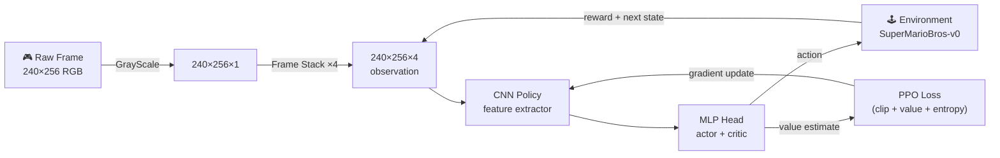

<div align="center">

# 🍄 Mario AI

**A deep reinforcement learning agent that masters Super Mario Bros from raw pixels**

[](https://python.org)
[](https://pytorch.org)
[](https://stable-baselines3.readthedocs.io)
[](LICENSE)

<br/>


</div>

---

## Overview

Mario AI trains a [Proximal Policy Optimization (PPO)](https://arxiv.org/abs/1707.06347) agent to play **Super Mario Bros** (NES) without any hand-crafted game logic. The agent observes only stacked greyscale pixel frames and learns entirely through trial and error — dying, respawning, and gradually figuring out how to run further and score higher.

After ~1 million environment steps the agent reliably clears World 1-1 and begins generalising to later levels.

---

## Architecture



| Component | Detail |
|---|---|
| **Algorithm** | PPO (Proximal Policy Optimization) |
| **Policy** | `CnnPolicy` — CNN feature extractor → MLP head |
| **Observation** | 4 stacked greyscale frames (240 × 256 × 4) |
| **Action space** | 7 discrete actions (`SIMPLE_MOVEMENT`) |
| **Framework** | Stable Baselines3 + PyTorch |

---

## Quick Start

### 1. Clone & install

```bash
git clone https://github.com/YOUR_USERNAME/mario-ai.git
cd mario-ai
pip install -r requirements.txt
```

### 2. Train the agent

```bash
python main.py train
```

Checkpoints are saved to `./train/best_model_<step>.zip` every 10 000 steps.  
Open TensorBoard in a second terminal to watch live metrics:

```bash
tensorboard --logdir ./logs/
```

### 3. Watch it play

```bash
python main.py play
```

The CLI automatically loads the latest checkpoint. Pass `--model` to pick a specific one.

---

## CLI Reference

```
python main.py <command> [options]
```

### `train` — train a new agent or resume

| Flag | Default | Description |
|---|---|---|
| `--config PATH` | `configs/default.yaml` | YAML config file |
| `--timesteps N` | 1 000 000 | Total environment steps |
| `--resume PATH` | — | Checkpoint `.zip` to continue from |
| `--lr FLOAT` | 1e-6 | Learning rate override |
| `--n-steps N` | 512 | Rollout steps per update |
| `--checkpoint-freq N` | 10 000 | Save every N steps |
| `--movement` | `simple` | `simple` \| `right_only` \| `complex` |

```bash
# Train from scratch
python main.py train

# Resume from a specific checkpoint
python main.py train --resume ./train/best_model_70000

# Faster initial learning with a restricted action space
python main.py train --movement right_only --timesteps 500000
```

### `play` — watch the agent

| Flag | Default | Description |
|---|---|---|
| `--model PATH` | auto (latest) | Checkpoint to load |
| `--episodes N` | 5 | Episodes to run |
| `--no-render` | — | Disable game window (headless) |

```bash
python main.py play
python main.py play --model ./train/best_model_70000 --episodes 3
```

### `checkpoints` — list saved models

```bash
python main.py checkpoints
python main.py checkpoints --dir ./train/
```

### `info` — configuration reference

```bash
python main.py info
```

---

## Configuration

All hyperparameters live in `configs/default.yaml`. You can create additional
config files (e.g. `configs/fast.yaml`) and pass them with `--config`.

```yaml
# configs/default.yaml
env_name: "SuperMarioBros-v0"
movement: "simple"         # simple | right_only | complex
n_stack: 4

policy: "CnnPolicy"
total_timesteps: 1000000
learning_rate: 0.000001    # ← keep this LOW for visual RL
n_steps: 512
batch_size: 64
n_epochs: 10
gamma: 0.99
gae_lambda: 0.95
clip_range: 0.2
ent_coef: 0.01

checkpoint_dir: "./train/"
log_dir: "./logs/"
checkpoint_freq: 10000
```

### Movement presets

| Preset | Actions | Notes |
|---|---|---|
| `right_only` | 5 | Fastest convergence — agent can only move right |
| `simple` | 7 | Recommended default |
| `complex` | 12 | Full NES button set — hardest to learn |

---

## Monitoring Training

Open TensorBoard to track:

```bash
tensorboard --logdir ./logs/
```

| Metric | Healthy trend |
|---|---|
| `train/policy_gradient_loss` | Decreasing ↓ |
| `train/explained_variance` | Increasing ↑ |
| `rollout/ep_rew_mean` | Increasing ↑ |
| `rollout/ep_len_mean` | Increasing ↑ |

> **Tip:** `explained_variance → 1.0` means the value network is accurately predicting returns — a strong signal that training is converging.

---

## Project Structure

```
mario-ai/
├── mario_ai/                  # Core package
│   ├── __init__.py
│   ├── agent.py               # MarioAgent — wraps PPO with build/load/train/predict
│   ├── callbacks.py           # TrainAndLoggingCallback — checkpointing + progress
│   ├── config.py              # TrainingConfig — all hyperparameters, YAML I/O
│   ├── environment.py         # MarioEnvironment — preprocessing pipeline
│   └── utils.py               # Checkpoint discovery, display helpers
├── configs/
│   └── default.yaml           # Default hyperparameters (edit here, not in code)
├── tests/
│   ├── test_config.py         # Config YAML round-trip tests
│   ├── test_utils.py          # Checkpoint helper tests
│   └── test_environment.py    # Environment pipeline tests (mocked)
├── train/                     # Auto-created — model checkpoints (.zip)
├── logs/                      # Auto-created — TensorBoard event files
├── MarioAIPy.ipynb            # Original exploratory notebook (preserved)
├── main.py                    # CLI entry point
├── requirements.txt
├── pyproject.toml
├── Makefile
└── .gitignore
```

---

## Running Tests

```bash
pip install pytest
python -m pytest tests/ -v
```

The test suite has **no heavy dependencies** — gym and torch are mocked, so tests run instantly without a GPU or display.

---

## How It Learns

The agent's training loop in plain English:

1. **Observe** — receive 4 stacked greyscale frames from the game.
2. **Act** — the CNN policy maps those frames to one of 7 actions.
3. **Receive reward** — Mario moves right (+), collects coins (+), dies (−).
4. **Buffer** — repeat for 512 steps, accumulating a rollout.
5. **Update** — compute the PPO objective (clipped surrogate loss + value loss + entropy bonus) and backpropagate through the CNN.
6. **Repeat** — iterate until `total_timesteps` is reached.

The entropy bonus (controlled by `ent_coef`) is key early on — it stops the agent from getting stuck jumping against the first pipe.

---

## Tips & Tricks

- **Learning rate is the most important hyperparameter.** `1e-6` is conservative but stable. Going above `1e-5` often causes training collapse with visual observations.
- **Start with `right_only`** if you want faster initial results — the reduced action space means fewer random deaths early in training.
- **Resume freely.** `python main.py train --resume ./train/best_model_X` continues where you left off and TensorBoard curves stay continuous.
- **More frames ≠ always better.** `n_stack=4` is the standard for NES games. Increasing it rarely helps and multiplies memory usage.

---

## References

- [Proximal Policy Optimization Algorithms — Schulman et al. (2017)](https://arxiv.org/abs/1707.06347)
- [Stable Baselines3 Documentation](https://stable-baselines3.readthedocs.io)
- [gym-super-mario-bros](https://github.com/Kautenja/gym-super-mario-bros)
- [OpenAI Gym](https://www.gymlibrary.dev)

---

## License

MIT — see [LICENSE](LICENSE) for details.